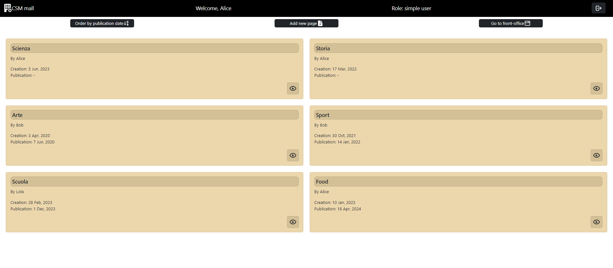
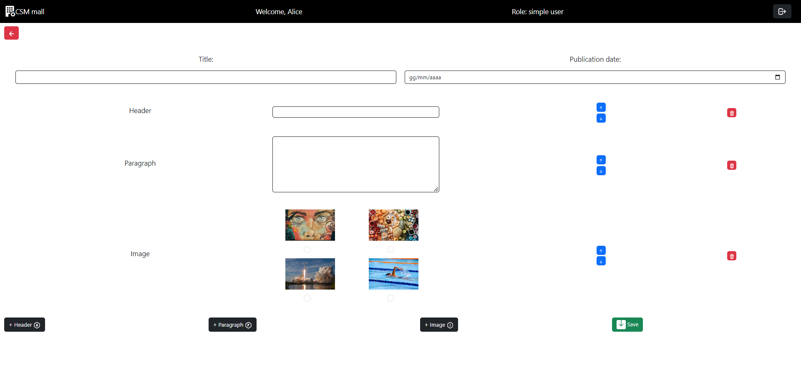

# Esame #1: "CMSmall"

## Studente: s314724 DEMOFONTI ALESSANDRO

## React Client Application Routes

- Route `/` : route di visualizzazione di tutte le pagine pubblicate, in caso di utente visitatore senza login
- Route `/backoffice` : route di visualizzazione di tutte le pagine create, in caso di utente autenticato a seguito di un login
- Route `/pages/:id` : route di visualizzazione dei dettagli e del contenuto di una specifica pagina
- Route `/edit/:id` : route di visualizzazione del form per la modifica di una specifica pagina già esistente
- Route `/add` : route di visualizzazione del form per l'aggiunta di una nuova pagina
- Route `/login` : route di visualizzazione del form di autenticazione al server
- Route `/*` : route in caso di utilizzo di una route non esistente, che ridirige ad una schermata di errore

## API Server

__Tutti i dati interscambiati tra server e client sono in un formato comune e comprensibile da entrambi. Il formato che si è deciso di utilizzare è il JSON__

- POST `/api/sessions`
  - description: login al server, creazione di una nuova sessione
  - request body: un oggetto con al suo interno l'username e la password digitati nel form per il login

  ```json
  {
    "username":"bob@test.it",
    "password":"pwd"
  }
  ```

  - responce: `200 Ok` (successo), `401 Unauthorized` (non autorizzato)
  - responce body: dati dell'utente

  ```json
  {
    "id": 2,
    "username": "bob@test.it",
    "name": "Bob",
    "admin": 1
  }
  ```
  
</br>

- GET `/api/sessions/current`
  - description: è necessaria l'autenticazione. Recupera le informazioni dell'utente corrispondente all'attuale sessione
  - request body: _None_
  - responce: `200 Ok` (successo), `401 Unauthorized` (non autorizzato)
  - responce body: dati dell'utente

  ```json
  {
    "id": 2,
    "username": "bob@test.it",
    "name": "Bob",
    "admin": 1
  }
  ```

</br>

- DELETE `/api/sessions/current`
  - description: è necessaria l'autenticazione. Logout, dell'utente nell'attuale sessione
  - request body: _None_
  - responce: `200 Ok` (successo), `401 Unauthorized` (non autorizzato)
  - responce body: _None_

</br>

- GET `/api/users`
  - description: è necessaria l'autenticazione ed i permessi di admin. Recupera l'identificativo e il nome di tutti gli utenti registrati nel database
  - request body: _None_
  - responce: `200 Ok` (successo), `403 Forbidden` (proibito, non abbastanza requisiti), `500 Internal Server Error` (errore generico)
  - responce body: array di oggetti contenenti ciascuno id e nome di un utente registarto nel database
  
  ```json
  [
    {
        "id": 1,
        "name": "Alice"
    },
    {
        "id": 2,
        "name": "Bob"
    },

    ...
  ]
  ```

</br>

- GET `/api/pages/published`
  - description: non è necessaria l'autenticazione. Recupera tutte i metadati di tutte le pagine che hanno lo stato settato su `published`, senza il loro contenuto interno, recuperato solo durante la visualizzazione nel dettaglio
  - request body: _None_
  - responce: `200 Ok` (successo), `500 Internal Server Error` (errore generico)
  - responce body: array con tutte le pagine correntemente nello stato `published`

  ```json
  [
    {
        "id": 2,
        "author_id": 2,
        "title": "Arte",
        "creation_date": "2020-04-03",
        "publication_date": "2020-06-07",
        "status": "published",
        "author_name": "Bob"
    },
    
    ...
  ]
  ```

</br>

- GET `/api/pages/created`
  - description: è necessaria l'autenticazione. Recupera tutte i metadati di tutte le pagine create attualmente presenti nel database, senza il loro contenuto interno, recuperato solo durante la visualizzazione nel dettaglio
  - request body: _None_
  - responce: `200 Ok` (successo), `401 Unauthorized` (non autorizzato), `500 Internal Server Error` (errore generico)
  - responce body: array con tutte le pagine correntemente nel database

  ```json
  [
    {
        "id": 1,
        "author_id": 1,
        "title": "Food",
        "creation_date": "2023-01-10",
        "publication_date": "2024-04-18",
        "status": "scheduled",
        "author_name": "Alice"
    },
    {
        "id": 3,
        "author_id": 2,
        "title": "Sport",
        "creation_date": "2021-10-30",
        "publication_date": "2022-01-14",
        "status": "published",
        "author_name": "Bob"
    },
    {
        "id": 5,
        "author_id": 1,
        "title": "Storia",
        "creation_date": "2022-03-17",
        "publication_date": null,
        "status": "draft",
        "author_name": "Alice"
    },

    ...
  ]
  ```

</br>

- GET `/api/pages/:id`
  - description: non è necessaria l'autenticazione. Recupera il contenuto di una particolare pagina
  - request body: _None_
  - responce: `200 Ok` (successo), `401 Unauthorized` (non autorizzato), `500 Internal Server Error` (errore generico)
  - responce body: oggetto contenente le informazioni ed il contenuto della pagina

  ```json
  {
    "id": 2,
    "content": "[ 
                  {\"pos\": 0,\"type\": \"header\",\"value\": \"Arte per tutti\"},
                  {\"pos\": 1,\"type\": \"paragraph\",\"value\": \"Ciao a tutti oggi parleremo di arte.\"},
                  {\"pos\": 2,\"type\": \"image\",\"value\": \"art.jpg\"}
                ]",
    "author_id": 2,
    "title": "Arte",
    "creation_date": "2020-04-03",
    "publication_date": "2020-06-07",
    "status": "published",
    "author_name": "Bob"
  }
  ```

</br>

- POST `/api/pages/add`
  - description: è necessaria l'autenticazione. Permette di aggiungere e salvare una nuova pagina nel database
  - request body: oggetto della nuova pagina

  ```json
  {
    "title": "TEST",
    "publication_date": "2023-06-26",
    "content": [
                  {"pos":0, "type":"header", "value":"FOOD"},
                  {"pos":1, "type":"image", "value":"food.jpg"}
               ]
  }
  ```

  - responce: `201 Created` (successo), `401 Unauthorized` (non autorizzato), `422 Unprocessable Entity` (errore nel corpo della richiesta), `500 Internal Server Error` (errore generico)
  - responce body: identificativo della pagina aggiunta

  ```json
  {
    "last_id": 7
  }
  ```

</br>

- PUT `/api/pages/:id`
  - description: è necessaria l'autenticazione. Permette ad un normale utente autenticato di modificare il contenuto di una sua pagina, mentre l'admin può modificare una qualsiasi pagina, con il potere aggiuntivo di poter cambiare anche l'autore della pagina
  - request body: oggetto contenente la pagina modificata

  ```json
  {
    "title": "TEST",
    "author_id": "2",
    "publication_date": "2023-07-17",
    "content": [
                  {"pos":0, "type":"header", "value":"FOOD"},
                  {"pos":1, "type":"image", "value":"food.jpg"}
               ]
  }
  ```

  - responce: `200 Ok` (successo), `401 Unauthorized` (non autorizzato), `403 Forbidden` (proibito, non abbastanza requisiti), `404 Not Found` (risorsa non trovata), `422 Unprocessable Entity` (errore nel corpo della richiesta), `500 Internal Server Error` (errore generico)
  - responce body: numero di modifiche effettuate nel database

  ```json
  {
    "changes": 1
  }
  ```

</br>

- DELETE `/api/pages/delete/:id`
  - description: è necessaria l'autenticazione. Permette ad un nomale utente autenticato di eliminare una sua pagina, mentre l'admin può eliminare una qualsiasi pagina
  - request body: _None_
  - responce: `200 Ok` (successo), `401 Unauthorized` (non autorizzato), `403 Forbidden` (proibito, non abbastanza requisiti), `404 Not Found` (risorsa non trovata), `500 Internal Server Error` (errore generico)
  - responce body: numero di modifiche effettuate nel database

  ```json
  {
    "changes": 1
  }
  ```

</br>

- GET `/api/title`
  - description: non è necessaria l'autenticazione. Permette di recuperare il titolo della pagina web
  - request body: _None_
  - responce: `200 Ok` (successo), `500 Internal Server Error` (errore generico)
  - responce body: titolo della pagina web

  ```json
  {
    "title": "CSM mall"
  }
  ```

</br>

- PUT `/api/title`
  - description: è necessaria l'autenticazione ed i permessi di admin. Permette all'admin di modificare il titolo della pagina web
  - request body: nuovo titolo della pagina

  ```json
  {
    "title": "CSM mall"
  }

  ```

  - responce: `200 Ok` (successo), `403 Forbidden` (proibito, non abbastanza requisiti), `422 Unprocessable Entity` (errore nel corpo della richiesta), `500 Internal Server Error` (errore generico)
  - responce body: nuovo titolo della pagina dopo il salvataggio nel database

  ```json
  {
    "new_title": "CSM mall"
  }
  ```

</br>

- GET `/api/images/path`
  - description: è necessaria l'autenticazione. Permette di recuperare tutti i nomi delle immagini presenti nella cartella `public`, lato server
  - request body: _None_
  - responce: `200 Ok` (successo), `401 Unauthorized` (non autorizzato), `500 Internal Server Error` (errore generico)
  - responce body: array oggetti contenenti un identificativo dell'immagine e il suo nome

  ```json
  [
    {
        "path": "art.jpg"
    },
    {
        "path": "food.jpg"
    },

    ...
  ]
  ```

</br>

## Tabelle del database

__Per visualizzare il contenuto iniziale del database, visualizzare il file `database_script` nella cartella `esame1-cmsmall-demoa00\server\database`__

- Tabella `users` utilizzata per mantenere le informazioni riguardanti gli utenti registrati all'applicazione
  - contiene i campi:

    ```text
    id - username - name - salt - password - admin -> PRYMARY KEY(id)
    ```

- Tabella `pages` utilizzata per mantenere i metadati e il contenuto delle pagine modificate/create nell'applicazione  
  - contiene i campi:

    ```text
    id - author_id - content - title - creation_date - publication_date - status -> PRYMARY KEY(id)
    ```

- Tabella `title` utilizzata per mantenere il titolo dell'applicazione, modificabile solo da un admin
  - contiene i campi:

    ```text
    id - title -> PRYMARY KEY(id)
    ```

- Tabella `images` utilizzata per informare il client delle immagine disponibili lato server, inseribili nelle pagine
  - contiene i campi:

    ```text
    id - path -> PRYMARY KEY(id)
    ```

## Principali componenti React

__Tutti i componenti custom realizzati per l'esame si trovano all'interno della cartella `esame1-cmsmall-demoa00\client\src\my_component`__

- `MyLogin` ( in `MyLogin.jsx` ): componente utilizzato per visualizzare il form di autenticazione al server
- `MyNavbar` ( in `MyNavbar.jsx` ): componente utilizzato per definire la barra di navigazione in cima a ciascuna schermata dell'applicazione. In essa vi è il bottone per effettuare il login/logout, nel caso di utente admin vi è anche il form di modifica del nome della pagina
- `MyMain` ( in `MyMain.jsx` ): componente utilizzato per richiedere al server le pagine da visualizzare
- `MyGridCards` ( in `MyGridCards.jsx` ): componente utilizzato visualizzare a video un'anteprima delle pagine, secondo una sequenza di righe contenenti ciascuna due pagine
- `MyPage` ( in `MyPage.jsx` ): componente utilizzato per la visualizzazione del contenuto di una pagina ( con l'ausilio del componente `MyComponentPage` ), con eventuali bottoni per la modifica/eliminazione della pagina che si sta visualizzando
- `MyComponentPage` ( in `MyComponentPage.jsx` ): componente utilizzato per effettuare il display a video di un singolo componente di una pagina.
- `MyEditPage` ( in `MyEditPage.jsx` ): componente utilizzato per effetuare sia la modifica, sia la creazione di una nuova pagina, sostanzialmente si tratta di un input form. Questo componente e i suoi sotto componenti si trovano nella cartella `esame1-cmsmall-demoa00\client\src\my_component\my_form_component`. Ciascuno dei componenti viene utilizzato per definire una parte del form, per non avere un unico grande componente molto complesso
- `MyPageNotFound` ( in `MyPageNotFound.jsx` ): componente utilizzato, per visualizzare una schermata di errore, in caso di inserimento di una errata route nella barra di navigazione del browser oppure a seguito di un errore ricevuto dal server dopo aver effettuato una richiesta. Questa pagina permette di ritornare alla default route `/`

## Screenshot




## Credenziali per gli user

- _username_: `alice@test.it` - _password_: `pwd`
  - ___`SIMPLE USER`___
  - __`possiede tre pagine`__
  
</br>

- _username_: `bob@test.it` - _password_: `pwd`
  - ___`ADMIN`___
  - __`possiede due pagine`__

</br>

- _username_: `lola@test.it` - _password_: `pwd`
  - ___`SIMPLE USER`___
  - __`possiede una pagina`__

</br>

- _username_: `trudy@test.it` - _password_: `pwd`
  - ___`SIMPLE USER`___
  - __`possiede nessuna pagina`__
